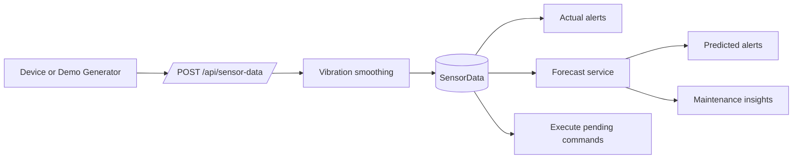

# SmartAI Backend

Express + MongoDB backend for the SmartAI factory monitoring platform. It stores users, machines, telemetry, alerts, predictions, commands, and activation audits, then exposes them through a JWT-protected REST API.

This document explains the backend structure, runtime flow, data models, services, middleware, and every route in the server.

## What This Backend Does

- Authenticates users with JWTs.
- Manages machine registration, activation, and threshold configuration.
- Accepts sensor readings from devices or the demo generator.
- Cleans vibration readings before storage.
- Creates alerts from actual and predicted values.
- Generates short-term predictions for multiple time horizons.
- Produces maintenance insights for the dashboard.
- Queues and executes machine control commands.
- Tracks activation history for audit purposes.
- Seeds a default admin account on first run.

## Tech Stack

- Node.js
- Express
- MongoDB with Mongoose
- JWT authentication
- bcrypt for password hashing
- CORS for frontend access
- dotenv for environment configuration
- mongodb-memory-server for demo or fallback database mode

## Project Structure

The backend is organized by responsibility:

- [src/index.js](src/index.js) boots the server, connects to MongoDB, seeds default data, and registers routes.
- [src/config/db.js](src/config/db.js) handles real MongoDB or in-memory MongoDB connections.
- [src/middleware/auth.js](src/middleware/auth.js) validates JWTs and applies demo fallback auth.
- [src/middleware/role.js](src/middleware/role.js) enforces role-based access control.
- [src/models](src/models) contains Mongoose schemas.
- [src/routes](src/routes) contains API endpoints.
- [src/services](src/services) contains business logic.

## How The Server Starts

The startup flow in [src/index.js](src/index.js) is:

1. Load environment variables with dotenv.
2. Create the Express app and enable JSON parsing and CORS.
3. Register all API route groups.
4. Connect to MongoDB using [src/config/db.js](src/config/db.js).
5. Create a default admin account if one does not exist.
6. Optionally seed a demo machine when demo mode is enabled.
7. Start the demo sensor generator when demo mode is enabled.
8. Listen on `PORT` or `4000`.

## Environment Variables

| Variable | Purpose | Default |
| --- | --- | --- |
| `PORT` | HTTP server port | `4000` |
| `MONGO_URI` | MongoDB connection string | `mongodb://127.0.0.1:27017/smartai` when demo is off and no URI is supplied |
| `MONGO_MEMORY` | Force in-memory MongoDB | `false` |
| `DEMO` | Enable demo behavior and fallback auth | `false` |
| `DATA_INTERVAL_SECONDS` | Demo generator interval | `5` |
| `ADMIN_EMAIL` | Default admin email | `admin@smartai.local` |
| `ADMIN_PWD` | Default admin password | `adminpass` |
| `JWT_SECRET` | JWT signing secret | `secret` |

## Quick Start

```powershell
cd Smart-AI-Backend
npm install

$env:PORT = '4000'
$env:DEMO = 'true'
$env:DATA_INTERVAL_SECONDS = '2'

npm start
```

On first run, the backend creates a default admin account if it does not already exist:

- Email: `admin@smartai.local`
- Password: `adminpass`

You can override both using `ADMIN_EMAIL` and `ADMIN_PWD`.

## Authentication And Roles

### JWT Auth

The login endpoint returns a JWT. The token is sent in the `Authorization` header as `Bearer <token>`.

### Demo Authentication

When `DEMO=true`, the auth middleware allows requests without a token by attaching a demo user with role `ADMIN`. This is useful for local testing and frontend demos.

### Canonical Roles

The system uses these canonical roles:

- `SYSTEM_ADMIN`
- `MAINTENANCE_ENGINEER`
- `MACHINE_OPERATOR`

Legacy aliases are still accepted in some places for backward compatibility:

- `ADMIN` maps to `SYSTEM_ADMIN`
- `OPERATOR` maps to `MACHINE_OPERATOR`

## Middleware

### [src/middleware/auth.js](src/middleware/auth.js)

This middleware:

- Reads the JWT from the `Authorization` header.
- Verifies it with `JWT_SECRET`.
- Stores the decoded payload in `req.user`.
- Falls back to a demo user when `DEMO=true` and no token is supplied.
- Returns `401` when the request is unauthorized.

### [src/middleware/role.js](src/middleware/role.js)

This middleware:

- Normalizes legacy roles to the canonical role set.
- Blocks requests when the user role is not in the allowed list.
- Returns `403` for forbidden access.

## Database Connection

The logic in [src/config/db.js](src/config/db.js) decides how MongoDB is connected:

- If `MONGO_URI` is set, it tries that connection first.
- If `MONGO_MEMORY=true`, it starts an in-memory MongoDB server.
- If `DEMO=true` and the real URI fails, it falls back to in-memory MongoDB.
- If no URI is provided and demo mode is off, it uses local MongoDB at `mongodb://127.0.0.1:27017/smartai`.

This makes local development and demo runs easier because the backend can still start without a production database.

## Data Models

### User

File: [src/models/User.js](src/models/User.js)

Stores application users.

- `name`: display name
- `email`: unique login email
- `passwordHash`: bcrypt hash of the password
- `role`: one of the supported roles
- `notifications`: simple notification preferences
- `createdAt`: creation timestamp

### Machine

File: [src/models/Machine.js](src/models/Machine.js)

Stores machine or device records.

- `hardwareId`: unique hardware identifier from the device or generator
- `machineName`: machine display name
- `location`: optional location label
- `status`: `PENDING`, `RUNNING`, `STOPPED`, or `WARNING`
- `speed`: current operating speed
- `thresholds`: warning and critical thresholds for temperature, vibration, and current
- `activatedAt`: activation timestamp
- `activatedBy`: user who activated the machine
- `createdAt`: creation timestamp

### SensorData

File: [src/models/SensorData.js](src/models/SensorData.js)

Stores telemetry readings.

- `machineId`: machine reference
- `temperature`: measured temperature
- `rawVibration`: original vibration value before cleanup
- `vibration`: cleaned vibration value used by the system
- `current`: current draw
- `timestamp`: reading time

### Alert

File: [src/models/Alert.js](src/models/Alert.js)

Stores actual and predicted alerts.

- `machineId`: source machine
- `parameter`: `temperature`, `vibration`, or `current`
- `value`: observed or predicted value
- `threshold`: threshold that was crossed
- `severity`: `LOW`, `MEDIUM`, or `HIGH`
- `source`: `ACTUAL` or `PREDICTED`
- `message`: human-readable alert message
- `resolved`: whether the alert has been cleared
- `timestamp`: alert time

### Command

File: [src/models/Command.js](src/models/Command.js)

Stores control commands for machines.

- `machineId`: target machine
- `commandType`: `STOP_MACHINE`, `REDUCE_SPEED`, or `START_MACHINE`
- `payload`: optional extra data
- `status`: `PENDING` or `EXECUTED`
- `createdAt`: creation time
- `executedAt`: execution time

### Prediction

File: [src/models/Prediction.js](src/models/Prediction.js)

Stores forecast output.

- `machineId`: target machine
- `horizon`: `15m`, `1h`, `6h`, or `24h`
- `temperature`: predicted temperature
- `vibration`: predicted vibration
- `current`: predicted current
- `confidence`: confidence score
- `createdAt`: creation time

### ActivationEvent

File: [src/models/ActivationEvent.js](src/models/ActivationEvent.js)

Stores audit records for machine activation.

- `machineId`: activated machine
- `hardwareId`: machine hardware identifier
- `activatedBy`: user who performed the activation
- `machineName`: name assigned at activation
- `location`: location assigned at activation
- `thresholds`: thresholds applied during activation
- `statusBefore`: previous status
- `statusAfter`: new status
- `timestamp`: audit time

## Services

### Auth Service

File: [src/services/authService.js](src/services/authService.js)

Responsibilities:

- Verify email and password during login.
- Create JWTs.
- Optionally override role in demo mode.
- Return the current user profile.
- Update profile fields and notification preferences.
- Change passwords after checking the current password.

### Data Generator

File: [src/services/dataGenerator.js](src/services/dataGenerator.js)

Responsibilities:

- Seed a pending machine if no machines exist.
- Generate synthetic readings on a timer.
- Occasionally register a new pending machine.
- Send readings through the same ingestion path used by real devices.

This service is only started when `DEMO=true`.

### Machine Data Ingestion

File: [src/services/machineDataIngestionService.js](src/services/machineDataIngestionService.js)

This is the main automation path in the backend.

It does all of the following:

- Validates incoming sensor payloads.
- Ensures the target machine exists.
- Cleans vibration data using recent history and spike suppression.
- Saves the sensor reading.
- Executes pending commands for the machine.
- Creates alerts from actual readings.
- Generates forecasts for all configured horizons.
- Creates predicted alerts from forecasted values.

Vibration cleanup is important because it prevents noisy or zero-filled readings from causing false alerts.

### Forecast Service

File: [src/services/forecastService.js](src/services/forecastService.js)

This service generates a simple forecast from recent sensor data.

It:

- Pulls the latest readings for a machine.
- Computes averages for temperature, vibration, and current.
- Estimates a linear slope from the oldest and newest data points.
- Projects values forward for the requested horizon.
- Assigns a confidence score based on the horizon and available history.
- Saves the result as a `Prediction` document.

### Maintenance Service

File: [src/services/maintenanceService.js](src/services/maintenanceService.js)

This service transforms machine state into maintenance guidance.

It supports three layers:

- Current-value recommendations from the latest sensor data.
- Predictive recommendations from stored forecasts.
- Combined maintenance output for UI use.

It also formats the final output for the dashboard and prediction pages.

### Insight Service

File: [src/services/insightService.js](src/services/insightService.js)

This file is deprecated and kept only for backward compatibility.

- It delegates to `MaintenanceService`.
- New code should import from [src/services/maintenanceService.js](src/services/maintenanceService.js) directly.

## Routes And API Endpoints

All routes are registered under the `/api` prefix unless noted otherwise.

### Auth Routes

File: [src/routes/auth.js](src/routes/auth.js)

Base path: `/api/auth`

- `POST /login`
	- Body: `{ email, password, role? }`
	- Returns a JWT and user summary.
	- In demo mode, `role` can override the token role.

- `GET /me`
	- Requires auth.
	- Returns the current user profile.

- `PUT /me`
	- Requires auth.
	- Updates `name`, `email`, and notification preferences.

- `PUT /me/password`
	- Requires auth.
	- Body: `{ currentPassword, newPassword }`
	- Changes the password after validating the current password.

### Machine Routes

File: [src/routes/machines.js](src/routes/machines.js)

Base path: `/api/machines`

- `GET /`
	- Requires auth.
	- Returns all machines except `PENDING` by default.
	- Query: `includePending=true` returns everything.

- `GET /pending`
	- Requires `SYSTEM_ADMIN`.
	- Returns only machines in `PENDING` state.

- `POST /`
	- Requires `SYSTEM_ADMIN`.
	- Manually creates a machine record.
	- Prevents duplicate `hardwareId` values.

- `PUT /:id/thresholds`
	- Requires `SYSTEM_ADMIN`.
	- Validates threshold ranges before saving.

- `POST /:id/activate`
	- Requires `SYSTEM_ADMIN`.
	- Activates a pending machine.
	- Sets thresholds, status, activation time, and activation user.
	- Writes an `ActivationEvent` audit record.

### Dashboard And KPI Routes

File: [src/routes/dashboard.js](src/routes/dashboard.js)

Base path: `/api`

- `GET /kpis/:machineId`
	- Requires auth.
	- Returns the latest temperature, vibration, current, and timestamp.

- `GET /alerts/active`
	- Requires auth.
	- Returns unresolved alerts from the last few days.
	- Query: `sinceDays` defaults to `3`.

- `GET /alerts`
	- Requires auth.
	- Returns paginated alerts.
	- Query filters: `page`, `limit`, `severity`, `resolved`, `machineId`, `startDate`, `endDate`.

- `DELETE /alerts/resolved`
	- Requires auth.
	- Deletes all resolved alerts.

- `PATCH /alerts/:id/resolve`
	- Requires auth.
	- Marks one alert as resolved.

- `POST /alerts/resolve`
	- Requires auth.
	- Marks multiple alerts as resolved.
	- Body: `{ ids: [...] }`
	- If no IDs are provided, all unresolved alerts are marked resolved.

### Prediction Routes

File: [src/routes/predictions.js](src/routes/predictions.js)

Base path: `/api/predictions`

- `GET /:machineId`
	- Requires `MAINTENANCE_ENGINEER` or `SYSTEM_ADMIN`.
	- Query: `horizon` defaults to `1h`.
	- Returns the latest predictions for that machine and horizon.

### Insights Routes

File: [src/routes/insights.js](src/routes/insights.js)

Base path: `/api/insights`

- `GET /:machineId`
	- Requires `MAINTENANCE_ENGINEER` or `SYSTEM_ADMIN`.
	- Query: `horizon` defaults to `1h`.
	- Produces maintenance insights dynamically.

### Analytics Routes

File: [src/routes/analytics.js](src/routes/analytics.js)

Base path: `/api`

- `GET /history/:machineId`
	- Requires `MAINTENANCE_ENGINEER` or `SYSTEM_ADMIN`.
	- Returns historical sensor data.
	- Query: `range` defaults to `24h`.

- `GET /peak-hours/:machineId`
	- Requires `MAINTENANCE_ENGINEER` or `SYSTEM_ADMIN`.
	- Aggregates recent sensor history by hour and returns average usage.

### Command Routes

File: [src/routes/commands.js](src/routes/commands.js)

Base path: `/api/commands`

- `POST /`
	- Requires auth.
	- Creates a control command for a machine.
	- Allowed command types: `STOP_MACHINE`, `REDUCE_SPEED`, `START_MACHINE`.
	- Enforces role restrictions per command type.

- `GET /pending/:machineId`
	- Requires auth.
	- Returns pending commands for a machine.

- `PUT /:id/execute`
	- Requires `SYSTEM_ADMIN`.
	- Marks a command as executed.

### User Routes

File: [src/routes/users.js](src/routes/users.js)

Base path: `/api/users`

- `GET /`
	- Requires `SYSTEM_ADMIN`.
	- Returns all users without password hashes.

- `POST /`
	- Requires `SYSTEM_ADMIN`.
	- Creates a new user.
	- Accepts only canonical roles.

- `PUT /:id/role`
	- Requires `SYSTEM_ADMIN`.
	- Updates a user role.

- `DELETE /:id`
	- Requires `SYSTEM_ADMIN`.
	- Deletes a user.

### Sensor Data Routes

File: [src/routes/sensorData.js](src/routes/sensorData.js)

Base path: `/api/sensor-data`

- `POST /`
	- Accepts raw telemetry from a device or external source.
	- Body requires `hardwareId`, `temperature`, `vibration`, and `current`.
	- In demo mode, unknown hardware IDs automatically create a running machine with default thresholds.
	- The payload is passed into the ingestion service.

- `GET /example`
	- Returns a sample request body for testing the sensor ingestion endpoint.

## Business Rules Worth Knowing

### Machine Lifecycle

- Newly created or auto-registered devices start as `PENDING`.
- Pending machines can store data, but they do not contribute to alerts, predictions, or insights until activated.
- Activating a machine sets it to `RUNNING` and attaches thresholds.

### Threshold Validation

Activation and threshold updates enforce safe ranges:

- Temperature: `0` to `150`
- Vibration: `0` to `50`
- Current: `0` to `200`

For each metric, the critical threshold must be greater than the warning threshold.

### Alert Creation

- Actual alerts are created immediately from fresh sensor readings.
- Predicted alerts are created from forecast data.
- Predicted alerts are deduplicated so the system does not spam repeated entries for the same machine, parameter, severity, and unresolved state.

### Command Execution

The ingestion pipeline automatically executes pending commands when new sensor data arrives.

- `STOP_MACHINE` sets status to `STOPPED` and speed to `0`.
- `REDUCE_SPEED` lowers speed, or uses `payload.newSpeed` when supplied.
- `START_MACHINE` sets status to `RUNNING` and restores speed.

### Vibration Cleanup

Vibration readings are smoothed before storage using recent history:

- Near-zero values are replaced with a stable local baseline.
- Small histories use gentle EWMA smoothing.
- Large spikes are pulled toward the local median.

This reduces false positives caused by noisy hardware readings.

## Demo Mode Behavior

When `DEMO=true`:

- Auth middleware allows requests without a token by attaching a demo user.
- The database connection can fall back to in-memory MongoDB.
- A demo machine is created automatically if no machines exist.
- The demo generator starts sending synthetic sensor readings.
- Unknown sensor hardware IDs can auto-create machines in the sensor data route.

## Main Data Flow



## How The Pieces Fit Together

- [src/index.js](src/index.js) wires all routes together.
- [src/services/machineDataIngestionService.js](src/services/machineDataIngestionService.js) is the central business pipeline.
- [src/services/forecastService.js](src/services/forecastService.js) creates predictions used by alerts and insights.
- [src/services/maintenanceService.js](src/services/maintenanceService.js) turns telemetry and predictions into actionable maintenance output.
- [src/routes/dashboard.js](src/routes/dashboard.js) exposes alert and KPI views for the UI.

## Extending The Backend

If you add a new endpoint or service, keep the same pattern:

- Put request handling in a route file.
- Put business logic in a service.
- Put persistent data shape changes in a model.
- Protect sensitive routes with `authenticate` and `requireRoles`.
- Keep demo behavior isolated so production logic stays clean.

## Notes For Frontend Integration

- Send `Authorization: Bearer <token>` on protected requests.
- Use `/api/auth/login` to get the token.
- Use `/api/machines/pending` and `/api/machines/:id/activate` for admin machine workflows.
- Use `/api/sensor-data` for raw telemetry ingestion.
- Use `/api/alerts`, `/api/predictions/:machineId`, and `/api/insights/:machineId` for operational views.

## Summary

This backend is designed as a single pipeline:

1. Users authenticate and receive JWTs.
2. Machines are created or auto-registered.
3. Sensor readings are ingested.
4. Readings are cleaned, stored, and analyzed.
5. Alerts, predictions, commands, and maintenance insights are generated from the same data stream.

That makes the system easy to demo now and straightforward to replace with real hardware later.
